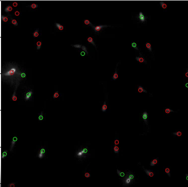

# TIMAG 2023 - PROYECTO FINAL  
# DETECCION DE REACCIÓN ACROSOMAL

## Descripcion Proyecto

Este es el repositorio del proyecto de detección de reacción acrosomal. 

La pagina web del proyecto se puede encontrar [aqui](https://iboero.pages.fing.edu.uy/grupo1timag/).


El proyecto pretende recibir un segmento de video de espermatozoides con la cabeza fijada, los cuales se le agrega progesterona. Esta sustancia provoca que algunos de los esperamtozoides reaccionen. La idea es detectar cuáles de estos espermatozoides reaccionan, de forma de poder hacer un posterior análisis. 

Para esto se utilizan estrategias de umbralziación, morfología y trackeo para poder encontrar y seguir cada espermatozoide a lo largo del video. Luego se obtienen dos conjuntos de estadísticas para cada espermatozoide, y a partir de estas y un poco de conocimiento sobre reacción acrosomal, se detecta cuando un espermatozoide reacciona.

En los siguientes **videos** se observan el video de entrada, y el resultado final de procesar el video. En verde se encuentran aquellos espermatozoides que reaccionaron según nuestro algoritmo.


[](page_conf/content/images/canal_fluo.mp4)
[](page_conf/content/images/reaccion.mp4)


## Descripción Repo
La base de datos utilizada es privada y puede descargarse [aqui](https://drive.google.com/drive/folders/1qz0pKqzCH1xABSosfddQ5trlzbb2u1z0?usp=drive_link) 


En el directorio **data** se encuentra un video en formato .tif de esta bases.

En la carpeta **src** se encuentra el código desarrollado en el proyecto. Este consiste en un archivo .ipynb, el cual en la primera celda se elige el camino al video a analizar, y un conjunto de hiperparametros que permite ajustar levemente el comportamiento del código.

## Uso
Para correr el video utilizado como ejemplo simplemente descargar el repositorio como

```
git clone git@gitlab.fing.edu.uy:iboero/grupo1timag.git
```
Luego se debe descargar un video de ejemplo a la carpeta data. Para esto descargar el [siguiente](https://drive.google.com/file/d/1u6CXcExtsuIQfag4tEmKOvyz540hFRRL/view?usp=sharing) archivo, y colocarlo en la carpeta **data** del repositorio


Finalmente abrir localmente el archivo ''DeteccionAcrosomal.ipynb'' y correr todas las celdas.

En caso que se quiera utilizar otro video, se debe cambiar el hiperparámetro PATH por el camino relativo al nuevo video. 

También puede probar cambiar los otros hiperparámetros para mejorar el resultado, sin embargo esto es muy particular para cada video y requiere un conocimiento de cómo funciona tanto las herramientas de tratamiento de imágenes como las reacciones acrosomales.

## Autores

  -Ignacio Boero: iboero@fing.edu.uy

  -Santiago Diaz: santiago.diaz.vazquez@fing.edu.uy

  -Tomas Vazquez: tomas.vazquez@fing.edu.uy
