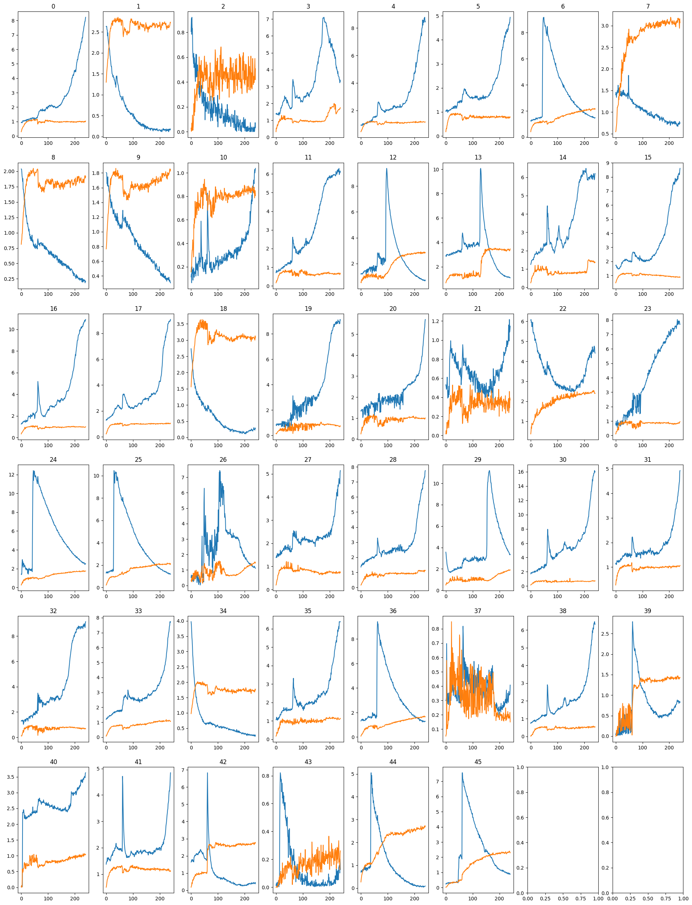

Title: Experimentos
Date: 2023-07-03
Category: Page
Ordinal: 004

En esta sección se observa el resultado de aplicar el proceso a un video, paso a paso.

## Videos Iniciales

En primer lugar se observa los canal fluo y membrana de un video. Estos son los videos con los que se debe trabajar durante el proyecto. En particular, se utiliza el canal de fluo para la ajuste y trackeo de elipses, mientras que el canal membrana se utiliza únicamente para obtener las estadisticas y detectar cuales de las elipses reaccionan

    <video width="640" height="640" controls>
    <source src="../images/canal_fluo.mp4" type="video/mp4">
    </video>

    <video width="640" height="640" controls>
    <source src="../images/canal_membrana.mp4" type="video/mp4">
    </video>

## Ajuste de Elipses

Luego se muestra el resultado de aplicar umbralización, morfologia y ajuste de elipses.

Se observa como las elipses encontradas parecen estar cerca de donde se encuentran espermatozoides, sin embargo algunas espermatozoides presentan dos elipses, mientras que otros presentan varias elipses muy pequeñas, o algunas presentan elipses que aparecen y desaparecen. Por lo tanto va a ser necesario poder filtrar estas elipses. 

Sin embargo, para hacer esto primero es necesario lograr trackear estas elipses a lo largo del video, y luego filtrar todas las apariciones de una elipse a lo largo del video, en caso de que no cumplan unos requisitos minimos. Esto se resuleve en la siguiente sección

    <video width="640" height="640" controls>
    <source src="../images/tracking.mp4" type="video/mp4">
    </video>

## Trackeo y Filtrado de Elipses

En primer lugar se trackean las elipses. Esto asocia una id a cada elipse, la cual para las elipses del frame t, observa cuales son las más cercanas en el frame t-1 y las asocia a un mismo id. Tambien se tienen en cuenta un monton de detalles que provoca que este trackeo no sea tan directo, lo cual fue explicado en la sección anterior. 

 Una vez identificada cada elipse, se filtran aquellas que aparecen en pocos frames, aquellas que son muy pequeñas o muy grandes, y en el caso de encontrar dos muy cercanas, se descarta aquella que menos intensidad presente en sus pixeles.

Se puede observar como ahora el resultado es mucho mejor, teniendo una elipse por espermatozoide, de un tamaño razonable, la cual se mantiene a lo largo del video. 

Sin embargo todavia se tiene un problema. La único que esta fijo de la elipse es la punta de la cabeza, y no todo el espermatozoide, por lo que sería útil quedarse solo con una elipse que contenga la cabeza. 

    <video width="640" height="640" controls>
    <source src="../images/filled.mp4" type="video/mp4">
    </video>

## Obtención de Cabeza del Espermatozoide en la elipse

Para esto, para cada elipse se calculan dos centros por frames, explicado en la pestaña métodos, y luego se queda con uno de estos dos centros. Finalmente se toma como cabeza del espermatozoide un circulo de radio fijo y centrado en este centro encontrado. 

Se observan los dos centros obtenidos. Se observa como algunos de estos logran centrarse en la cabeza, mientras que otros se encuentran un poco corridos. Creemos que este es el punto más débil de nuestro algoritmo y el cual se debe pulir. De todas formas, se terminan con un centro por elipse y por frame.

 Por último se toma la desición de tomar un único centro por elipse a lo largo de todo el video. Para esto se toma el promedio del centro a lo largo de los frames. Esto demuestra obtener un centro un poco más correcto, cercano a la cabeza. Aparte tambien permite que al calcuar las estadisticas estas sean más estables, y que no sufran saltos grandes debido a que un centro salta de forma abrupta.

    <video width="640" height="640" controls>
    <source src="../images/cabezas_2.mp4" type="video/mp4">
    </video>

## Calculo de Estadisticas

Los pasos restantes son para lograr detectar cuales de estas elipses reaccionan. Estos pasos son más de procesado de señales que de tratamiento de imagenes. Para esto se calcula la intensidad promedio del canal fluo y canal membrana para cada cabeza hallada en el paso anterior a lo largo del tiempo. Esto resulta en las siguientes gráficas.

<figure style="text-align: center;">
    <!--Incluir camino a la imagen a mostrar-->
    
    <figcaption>
    fig_reaccion :: Estadisticas Fluo y Membrana.
    </figcaption>
</figure>

Para detectar una reacción, se debe observar que un punto en el tiempo donde el canal fluo de un espermatozoide tenga una subida rapida y luego decaiga, mientras que el canal membrana debe subir lentamente y luego no disminuir. Para esto, se utiliza un índice de reacción, el cual corresponde a $e^{\frac{-x}{y}}$, donde $x$ es la intensidad del canal fluo e $y$ del canal membrana. Esto es siguiendo la idea de la tesis [@fa2021]

Finalmente, se decide que un espermatozoide reacciona si esta indice logra superar cierto umbral, y mantenerse constante por encima de este una vez superado. 

<figure style="text-align: center;">
    <!--Incluir camino a la imagen a mostrar-->
    
    <figcaption>
        fig_reaccion :: Indice de Reacción Acrosomal.
    </figcaption>
</figure>

## Detección de RA

En primer lugar, se cuentan la cantidad de espermatozoides encontrados por el método, las cuales son 42 espermatozoides. La base de datos no presenta un ''ground truth'', y es complicado contar la cantidad exacta de espermatozoides, ya que algunos aparecen muy tenuamente, sin contar cuando hay dos superpuestos es complicado diferenciarlos a ojo. Sin embargo observando la imagen, podemos acotar la cantidad a un valor entre 40-45 espermatozoides.

Con respecto a los que se detectan como que reaccionan, estos son un total de 15, representando un 33% del total. Este dato tampoco se tiene el ''ground truth'', y en este caso es bastante más complicado medir esta cantidad viendo el video, ya que la reacción no solo implica un aumento del canal fluo, sino que debe ademas reducirse rapidamente, lo cual es subjetivo de medir, y ademas aumentar el canal membrana y no disminuir. Poder deducir este valor observando los videos queda un fuera del alcanze de nuestro trabajo. De todas, formas, observando el resultado, creemos que esta dentro de lo aceptable.

En el siguiente video se observan en verde aquellas elipses detectadas como que reaccion, y en rojo aquellos que no, primero con el canal fluo de fondo y segundo con el canal membrana de fondo

Se observa que aquellas detectadas como que reaccionaron, efectivamente en algun instante aumentan rapidamente su canal fluo y luego disminuyen rapidamente. Tambien se observa como estas presentan un canal de membrana constante. Por otro lado, se observan algunas elipses detectadas como que no reaccionaron, pero presentan un repentino aumento en el canal fluo. Sin embargo, luego de este aumento, no presenta una bajada en este valor. Es por esto que no se clasifican como reacción.

    <video width="640" height="640" controls>
    <source src="../images/reaccion.mp4" type="video/mp4">
    </video>

    <video width="640" height="640" controls>
    <source src="../images/membrana_reaccion.mp4" type="video/mp4">
    </video>

