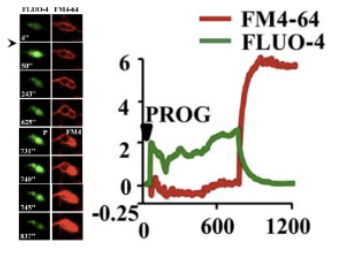

Title: Introducción
Date: 2023-07-03
Category: Page
Ordinal: 001

# PROYECTO - DETECCION DE REACCION ACROSOMAL

## ¿Qué es la RA?

La reacción acrosomal es un evento que ocurre en los espermatozoides durante el proceso de fecundación. Se trata de una serie de cambios bioquímicos y moleculares que resultan en la liberación de enzimas almacenadas en el acrosoma, una estructura situada en la cabeza del espermatozoide. Estas enzimas son responsables de desempeñar un papel fundamental en la penetración del espermatozoide en el óvulo.

## ¿Cuándo ocurre la RA?

Cuando un espermatozoide se acerca al óvulo, se desencadenan señales químicas que inducen la reacción acrosomal. Como resultado, el acrosoma se fusiona con la membrana plasmática del espermatozoide, liberando las enzimas acrosómicas al entorno circundante. Estas enzimas tienen la capacidad de degradar y disolver la capa externa del óvulo, conocida como zona pelúcida, lo que permite al espermatozoide atravesarla y fusionarse exitosamente con el óvulo.

El calcio intracelular es un indicador clave de la reacción acrosomal en los espermatozoides. Durante la reacción, se produce un aumento en la concentración de calcio dentro del mismo. Este aumento intracelular es uno de los desencadenantes principales de la liberación de enzimas acrosómicas. Por otro lado, la formación de fenestraciones permiten la exposición de la membrana acrosomal interna y la liberación del contenido acrosómico.

## ¿Cómo detectar la RA?

A través de la concentración de calcio intracelular y las fenestraciones (poros transcelulares) se puede detectar si un espermatozoide ha reaccionado acrosomalmente. Esto se hace a través de una microscopía de fluorescencia, en la que se utilizan fluorósforos para resaltar los eventos de interés. El Flúo-4 es un indicador de calcio, mientras que el FM4-64 marca la membrana celular. La detección de ambos permite decidir si el espermatozoide ha experimentado la reacción. En la siguiente imagen se puede observar la concentración de ambos indicadores en función del tiempo para un espermatozoide que experimentó una reacción acrosomal.

<figure style="text-align: center;">
  <!--Incluir camino a la imagen a mostrar-->
  
  <figcaption>
  fig_reaccion :: Imagen de reacción acromosal.
  </figcaption>
</figure>

En la figura {#fig_reaccion} se puede ver la concentración de membrana (verde) y calcio (rojo) en un espermatozoide en función del tiempo. La misma corresponde a un espermatozoide en el que se da la reacción acorsomal. Para lograr que los espermatozoides puedan reaccionar, se les inyecta progesterona. Como se puede ver en la gráfica, cuando se inyecta la progesterona aumenta levemente el nivel de calcio en el espermatozoide. Luego, para detectar si los espermatozoides experimentan la reacción acrosomal, se debe obtener las gráficas para cada uno de ellos y encontrar un comportamiento similar al de la gráfica.

