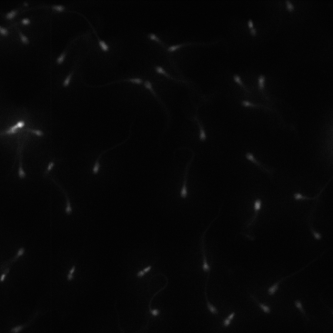
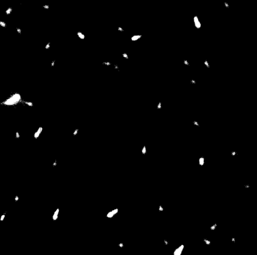
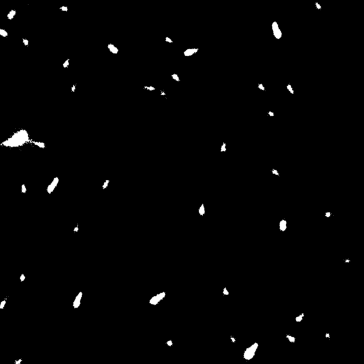
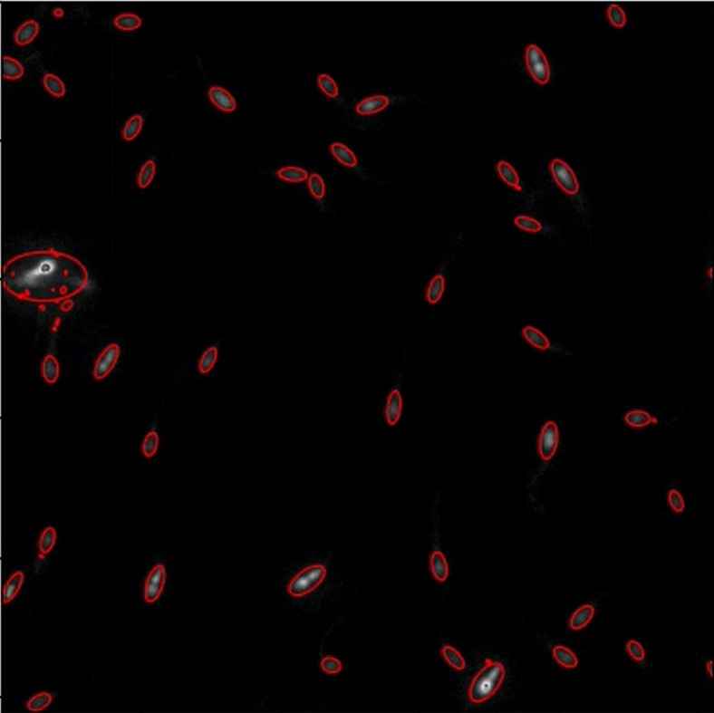
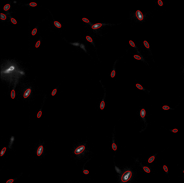
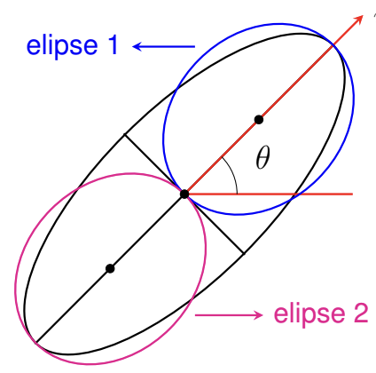
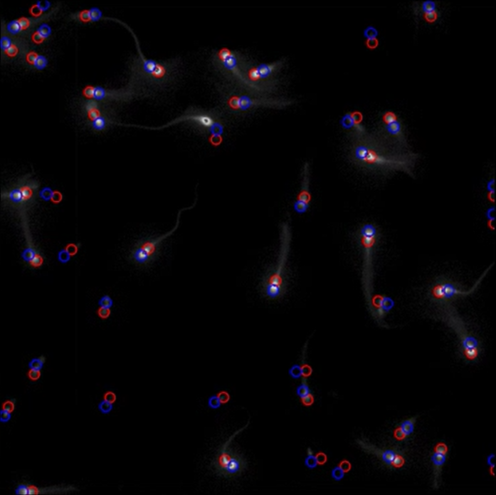
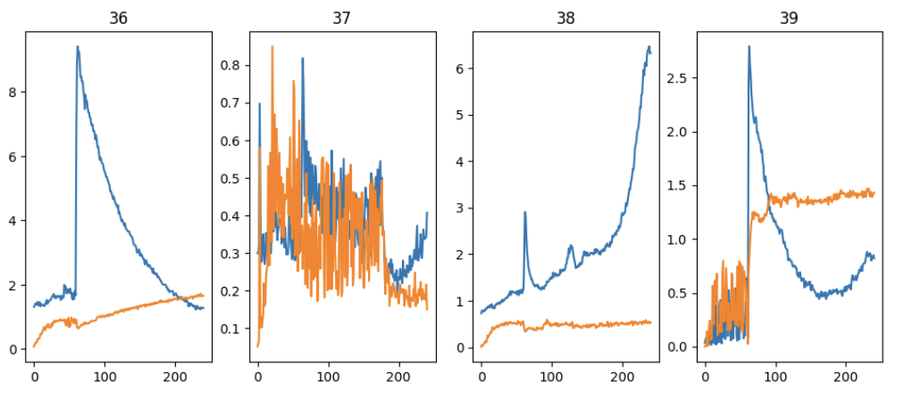
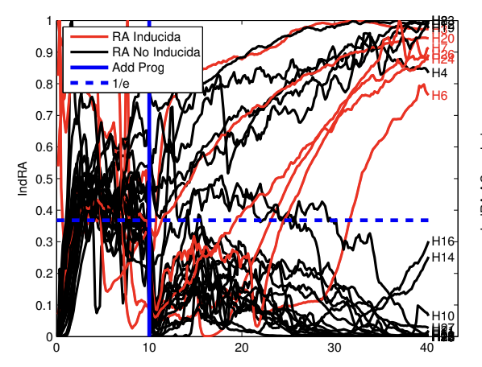

Title: Métodos y Técnicas
Date: 2023-07-03
Category: Page
Ordinal: 002

En esta página se describen los métodos y técnicas utilizados en el proyecto. Se explican los algoritmos estudiados, las herramientas usadas y las tecnologías y procesos implicados en la construcción del proyecto.
Para la realización del proyecto se exploraron diversas herramientas y algoritmos relacionadas al procesamiento de imágenes.

## Imagen inicial

Para comenzar, se toma un frame del canal flúo, sobre la cual se prueban las funciones que se van implementando. La imagen se puede ver a continuación:
<figure style="text-align: center;">
  <!--Incluir camino a la imagen a mostrar-->
  
  <figcaption>
  fig_esperma :: Imagen de uno de los frames del video, correspondiente al canal flúo.
  </figcaption>
</figure>

## Segmentación

Para detectar los espermatozoides en la imagen, se comienza aplicando segmentación. Se probaron diferfentes tipos de umbrales proporcionados por cv2, pero se observó que el mejor funcionamiento lo tenía el algoritmo de umbralización OTSU. 

El mismo utiliza el histograma de la imagen para encontrar un punto de corte donde la varianza entre dos clases de píxeles (por encima y por debajo del umbral) sea máxima. Este valor se convierte en el umbral óptimo para convertir la imagen en una representación binaria.

Se comenzó con la idea de un umbral fijo para todo el video, en donde se recorrían todas las imágenes obteniendo el valor de cada una, promediando al final. La idea detrás de esto era que, cuando algunos espermatozoides comenzaran a aumentar su intensidad en el canal calcio, los otros no fueran perdidos de vista gracias a un umbral alto en esa imagen. 

El problema de esto es que al principio de los videos se detectaban muy pocos espermatozoides debido a que la intensidad es muy baja en general, y al final se detectaban demasiados ya que la intensidad sube. Por tal razón se decidió cambiar a un umbral Otsu diferente para cada imagen. Un ejemplo del resultado se ve en la siguiente imagen.

<figure style="text-align: center;">
  <!--Incluir camino a la imagen a mostrar-->
  
  <figcaption>
  fig_segmentacion :: segmentacion aplicada a la imagen inicial.
  </figcaption>
</figure>

## Morfología

Se procedió a aplicar morfología en las imágenes. La idea era mejorar y resaltar las manchas segmentadas previamente. Con este objetivo utilizamos una función de cv2 que aplica morfología de cierre. Esto es útil para rellenar pequeños agujeros y unir objetos cercanos. 

El resultado se ve en la próxima iamgen. No se observa demasiado cambio en esta imagen respecto a la anterior, sin embargo, es importante para el siguiente paso en el que se aplicará un ajuste de elipses a las manchas.

<figure style="text-align: center;">
  <!--Incluir camino a la imagen a mostrar-->
  
  <figcaption>
  fig_morfologia :: morfología aplicada a la imagen anterior.
  </figcaption>
</figure>

## Ajuste de elipses

Como se mencionó previamente, lo siguente es ajustar elipses en las manchas encontradas. Para ello se comienza aplicando una función de cv2 llamada findContours que obtiene solamente los contornos de las manchas. Esto es necesario ya que posteriormente usaremos la función fitEllipse, que toma como entrada los contornos de las elipses a ajustar. 

Una vez llamada a esta función obtenemos por cada imagen una lista de elipses de la forma ((x,y), (largo,ancho), ángulo). El primer valor es el centro de la elipse en la imagen, el segundo es el tamaño del eje mayor y menor, y el tercero es el ángulo respecto a la vertical. Al superponer las elipses encontradas con la imagen original se obtiene el siguente resultado.

<figure style="text-align: center;">
  <!--Incluir camino a la imagen a mostrar-->
  
  <figcaption>
  fig_ajuste :: algoritmo de ajuste de elipses.
  </figcaption>
</figure>

Con las elipses ajustadas en cada imagen se crea una matriz que contiene toda la información de las mismas. La idea es lograr trackear a cada una en todo momento, por lo que cada elipse encontrada tendrá asociado un id. Con esta matriz obtendremos la posición de cada elipse en cada frame, con su respectivo tamaño y ángulo.

Una observación importante es que, como los espermatozoides a lo largo del video varían su intensidad, a veces no son detectadas. Para obtener elipses que se mantengan a lo largo de todo el video, se rellenan los valores faltantes con los valores de la misma elipse más próxima en el tiempo.

Otra observación es que el tamaño de las elipses a utilizar será siempre el mismo, ya que en general los esperamatozoides tienen el mismo tamaño. Se concluyó que las dimensiones 40x20 pixeles de radio mayor y menor respectivamente son aduecuadas. Los tamaños obtenidos serán utilizados solamente para el descarte de elipses que se mencionará a continuación.

## Descarte de elipses

En esta sección se realiza el trabajo de descarte de elipses, es decir, eliminar aquellas cuyos defectos puedan alterar el funcionamiento del algoritmo posteriormente.

Primero, se eliminan elipses según su tamaño. Aquellas cuyo tamaño era demasiado chico o grande eran borradas. El primer caso se debe a que, al ser tan chicas, se está detectando un espermatozoide que no se ve claramente. Esto es un problema ya que el ángulo del mismo generalmente no es el correcto, por lo que el ajuste de la elipse en el espermatozoide tampoco lo es. En el segundo caso el problema es que se detecta un conjunto de espermatozoides juntos, como si fuera uno solo. Esto tampoco es deseado y se procede a eliminarlo.

Luego, existen irregularidades en las imágenes que llevan a detectar espermatozoides inexistentes. Por lo tanto se eliminan aquellas que a lo largo de todo el video se detectan en pocos frames.

Por último, se reliza un descarte por cercanía. Si se detectan dos centros muy cerca uno del otro se descarta uno de ellos. Es necesario hacer este descarte ya que suele suceder que un espermatozoide que se mueve a lo largo del video genera una detección de dos centros. Para elegir con cual quedarnos se evalúa la intensidad en un entorno de pixeles vecinos. El que tenga una sumatoria mayor a lo largo de todo el video es el que se utilizará al final.

La imagen luego de hacer el descarte de elipses es la siguente:
<figure style="text-align: center;">
  <!--Incluir camino a la imagen a mostrar-->
  
  <figcaption>
  fig_descarte :: algoritmo de ajuste de elipses luego del descarte.
  </figcaption>
</figure>

## División de elipses

La información relevante en los espermatozoides se encuentra en la punta de la cabeza de los mismos, donde se encuentra el acrosoma. Por tal razón sería beneficioso poder quedarnos solamente con esa parte, y no con una elipse que incluya la cabeza y pieza intermedia del espermatozoide. El siguiente algoritmo primero separa la elipse inicial en dos, y luego decide cuál de las dos corresponde a la punta de la cabeza.

En un primer paso, se realiza la separación de las elipses. Para ello se utiliza el centro de las mismas y sus ángulos para generar dos nuevos puntos a lo largo del eje mayor. Un ejemplo de esto se ve en la imagen {#fig_esley}. Se toma una distancia de 10 pixeles entre el centro original y cada uno de los centros nuevos. Una vez separados los centros, se crearán dos elipses de tamaño 20x20, por lo que el ángulo tampoco será utilizado a partir de ahora.
 
<figure style="text-align: center;">
  <!--Incluir camino a la imagen a mostrar-->
  
  <figcaption>
  fig_esley :: Algoritmo de separación.
  </figcaption>
</figure>

Una vez obtenidos los dos nuevos centros de las elipses, se procede a realizar un trackeo de ambas elipses en el tiempo. Es decir, al obtener dos nuevas elipses, debemos tenerlas identificadas a lo largo del tiempo, ya que una corresponderá a la cabeza del espermatozoide y la otra a la cola. Este trackeo se realiza mediante distancia entre los centros de un frame a otro. Cabe destacar que hasta este momento no se conoce cuál punto corresponde a la cabeza y cuál a la cola.

A partir de los dos nuevos centros de las elipses se debe realizar la clasificación de cabeza y cola. Observando los videos, logramos observar que los espermatozoides giran en torno a un eje centrado en la punta de la cabeza del espermatozoide. Por lo tanto, si se halla la varianza de los dos centros a lo largo de todos los frames, sucede que la varianza correspondiente a los centros de las cabezas debería ser menor, ya que se mueve menos. 

Esto funciona bien para muchos casos, pero para otros no. Por esto mismo, se decidió incluir otro método de clasificación para los casos en que esto no está bien definido. Es decir, se halla el valor absoluto de la resta entre ambas varianzas, y en caso de que el resultado sea menor a cierto umbral (se eligió 5 experimentalmente), quiere decir que el método de las varianzas no es tan fiable y por lo tanto clasificamos según otro método. Este otro método halla la intensidad dentro de las elipses, y escoge aquella con más intensidad a lo largo del video como la cabeza, que es donde ocurre la reacción.

 Esta metodología funciona bien para la clasificación en la mayoría de los casos, mientras que falla para un porcentaje bajo de espermatozoides. En la imagen {#fig_separacion}, las elipses rojas corresponden a las cabezas, mientras que las azules a las colas. 
 
<figure style="text-align: center;">
  <!--Incluir camino a la imagen a mostrar-->
  
  <figcaption>
  fig_separacion :: Ejemplo de la separación de elipses.
  </figcaption>
</figure>

## Intensidad dentro de las elipses

Una vez obtenidas las elipses, se procede a calcular los valores de intensidad dentro de las mismas para cada frame, para cada canal. A partir de esos datos, se grafican las intensidades de ambos canales en función del tiempo para las elipses. En la figura {#fig_ej_graficas} se pueden observar algunos ejemplos. A simple vista se ver que algunos efectivamente están experimentando la reacción ya que la forma de las curvas se corresponde con el modelo teórico. 

<figure style="text-align: center;">
  <!--Incluir camino a la imagen a mostrar-->
  
  <figcaption>
  fig_ej_graficas :: Ejemplo de gráficas obtenidas para ambos canales.
  </figcaption>
</figure>

## Clasificación de reacción

Al producirse la reacción acrosomal, el valor de Flúo-3 decae y el de Fm4-64 aumenta. Se debe producir la intercepción de los gráficos, es por ello que se utiliza como indicador de reacción (IndRA) una función que tenga en cuenta las propiedades antes mencionadas para decidir si el espermatozoide experimento la RA. Nosotros seguimos la idea utilizada en [@fa2021], la cual utiliza la funcion $e^{-\frac{x}{y}}$ para obtener este indice, donde $x$ corresponde al valor de intensidad del canal flúor e $y$ corresponde al valor de intensidad del canal membrana.

Como se puede observar en la siguiente imagen {#fig_exponenciales}, aquellos espermatozoides que reaccionan (los que tienen curva roja) son aquellos que superan cierto umbral y se mantienen por encima del mismo. Por lo tanto para realizar la clasificación, se etiquetan como reaccionados aquellos espermatozoides que tengan los últimos 14 frames por encima de un umbral de 0.5. El valor de este es similar al usado en [@fa2021].

<figure style="text-align: center;">
  <!--Incluir camino a la imagen a mostrar-->
  
  <figcaption>
  fig_exponenciales :: Curvas exponenciales.
  </figcaption>
</figure>